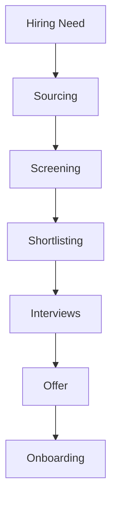
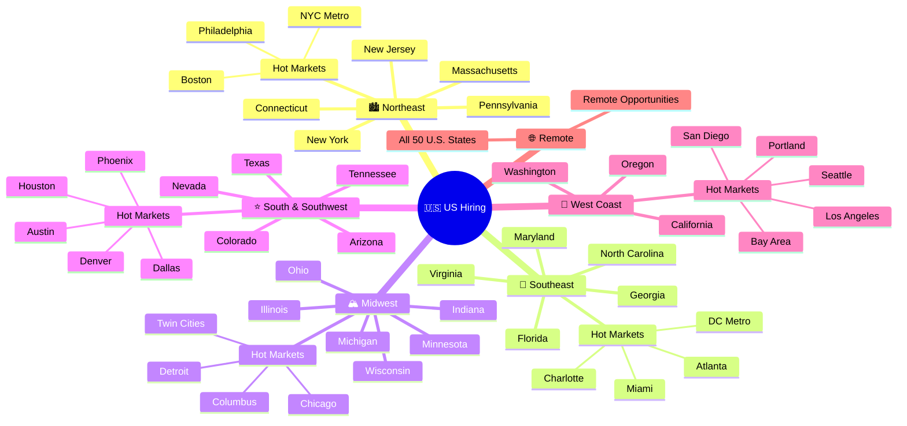

<p align="center">  </p>

<div align="center">

[](https://git.io/typing-svg)

</div>

<h3 align="center">

<a href="https://github.com/ITRecruitersachin?tab=followers">
&nbsp;&nbsp;

<a href="https://github.com/ITRecruitersachin?tab=repositories">


</a>
</h3>

---

<div align="center">
<a href="https://git.io/typing-svg">

</a>

<a href="https://git.io/typing-svg">

</a>
</div>

<div align="center">


<br/>


</div>

<div align="center">

[](https://linkedin.com/in/recruitersachin)
[](mailto:writeforsachin@gmail.com)
[](https://wa.me/919742080111)
[](https://calendly.com/ITRecruitersachin)
[](https://drive.google.com/sachin-resume)
[](https://github.com/ITRecruitersachin)

</div>

<br/>

---
## 📖 Table of Contents
About • Nationwide Coverage • Domain Expertise • Engagement Types • Legal & Compliance • Core Skills • Sourcing Channels & Tools • ATS/CRM/VMS Ecosystem • Performance Metrics • Work Authorization • Database Growth • Experience Timeline • Certifications • Why Work With Me • GitHub Analytics • Testimonials • Contact

---

##  &nbsp;About Sachin

<table>
<tr>
<td width="55%">

```yaml
# ══════════════════════════════════════
#   SACHIN  |  RECRUITER PROFILE CARD
# ══════════════════════════════════════

Identity:
  Name        : "Sachin"
  Title       : "Lead US IT Recruiter"
  Pronouns    : "He / Him"
  Location    : "Bangalore, Karnataka, India 🇮🇳"
  Timezone    : "IST (GMT+5:30)"

Availability:
  Status      : "🟢 AVAILABLE IMMEDIATELY"
  Notice      : "⚡ ZERO days — join today"
  Remote      : "✅ All Over India"
  Onsite      : "✅ Bengaluru / Hybrid"
  Work_type   : ["FTE", "Contract", "C2H"]

Experience:
  Years       : "10+"
  TAT         : "24 HRS"
  OAR         : "95%"
  Fill_time   : "48 hrs avg"
  Clients     : "100+"
  Team_led    : "5 recruiters"

Expertise:
  - Full-Cycle US IT Recruiting
  - Cloud · AI/ML · DevOps · Data Eng
  - SAP · Salesforce · Cybersecurity
  - W2 / C2C / 1099 Tax Structures
  - Citizen · Green Card · TN VISA · H-1B · H-4 EAD · L-2 EAD · CPT · OPT · STEM OPT · E-3 · L-1A/L-1B · O-1 · EAD
  - Direct Client · MSP · VMS · RPO · Staff Augmentation · Statement of Work (SOW) · Prime Vendor · Sub-Vendor
  · Preferred Supplier Program (PSP) · Master Service Agreement (MSA) · Federal Government · State Government
  · Enterprise Accounts · Time & Materials (T&M) · Project-Based Hiring"
  - High-Volume & Executive Search

contact:
  email       : "writeforsachin@gmail.com"
  linkedin    : "linkedin.com/in/recruitersachin"
  whatsapp    : "+91-9742434111"

motto: >
  "Every placement is a promise.
   Speed, quality, trust — always."
```

</td>
<td width="45%" align="center">

<br/><br/>


</td>
</tr>
</table>

---

## 🟢 Availability Status
# 📍 Availability

<div align="center">

| Status | Details |
|:------|:---------|
| 🟢 Availability | Immediate Joiner |
| 🌍 Coverage | All 50 US States + Washington D.C. |
| 🏢 Work Mode | Remote • Hybrid • Onsite |
| 📍 Location | Bengaluru, India |
| 🕐 Time Zone | IST • Flexible with US EST/CST/MST/PST |
| 💼 Hiring Models | W2 • 1099 • Contract • Full-Time |
| 📞 Interview | Same Day Scheduling |

</div>

---

# 🤝 Connect With Me

<div align="center">

[](https://linkedin.com/in/recruitersachin)

[](mailto:writeforsachin@gmail.com)

[](https://wa.me/919742080111)

[](https://calendly.com/ITRecruitersachin)

</div>

---
<!-- ========================================================= -->
<!--              CAREER IMPACT & RECRUITER DASHBOARD          -->
<!-- ========================================================= -->

# 📊 Recruiter Dashboard

<div align="center">

| 💼 Experience | 🌎 Coverage | ⚡ Availability | 🎯 Hiring Models |
|:-------------:|:-----------:|:---------------:|:----------------:|
| **10+ Years** | **50 U.S. States + D.C.** | **Immediate** | **W2 • 1099 • Contract • FTE** |

</div>

---

# 🏆 Career Highlights

<div align="center">

| Metric | Achievement |
|:-------|:------------|
| 💼 Experience | 10+ Years in US IT Recruitment |
| 🌎 Coverage | Nationwide (50 States + D.C.) |
| 👥 Recruitment Type | Federal Government • State Government • Commercial • Enterprise • Fortune 500 |
| 🔍 Sourcing | AI-Powered + Semantic + Skills-Based Matching + Talent Intelligence + Candidate Enrichment + Boolean + X-Ray + Workflow Automation |
| 📄 Hiring | W2 • 1099 • Contract • CTH • Full-Time |
| 💻 Domains | Cloud • AI • Cybersecurity • ERP • Data • Infrastructure |
| 🗂 ATS | Bullhorn • JobDiva • Ceipal |
| 🏢 VMS | Fieldglass • VectorVMS • Beeline |

</div>

---

# 🧠 Core Recruiting Skills

<div align="center">

| Intelligent Talent Acquisition | Advanced Technical Recruiting | Strategic Recruitment Delivery |
|:-------------------------------|:------------------------------|:-------------------------------|
| AI-Powered Sourcing | AI / ML & GenAI | End-to-End Recruitment |
| Talent Intelligence | Software Engineering | Full-Cycle Recruitment |
| Semantic Search | Cloud Computing (AWS, Azure, GCP) | Recruitment Delivery |
| Skills-Based Matching | Cloud & Platform Engineering | Candidate Screening |
| Candidate Enrichment | Data Engineering | Technical Assessment |
| Advanced Boolean Search | Data Science & Analytics | Resume Evaluation |
| Google X-Ray Search | Machine Learning | Interview Coordination |
| OSINT Research | Deep Learning | Hiring Manager Partnership |
| LinkedIn Recruiter | LLM Engineering | Client Relationship Management |
| Passive Talent Sourcing | Prompt Engineering | Stakeholder Management |
| Talent Mapping | AI Agents & Agentic AI | Offer Negotiation |
| Talent Pipeline Development | MCP (Model Context Protocol) | Compensation & Rate Negotiation |
| Market Intelligence | Retrieval-Augmented Generation (RAG) | Candidate Experience |
| Competitive Talent Intelligence | Vector Databases | Pre-Closing & Closing |
| Diversity Talent Sourcing | LangChain & LangGraph | Onboarding |
| Executive Search | LlamaIndex | Compliance |
| Internet Research | Python Development | SLA & KPI Delivery |
| Referral Recruiting | Java Development | Vendor Management |
| Social Recruiting | .NET Development | ATS & CRM Management |
| GitHub Sourcing | JavaScript / TypeScript | Recruitment Operations |
| Stack Overflow Sourcing | React.js | Workforce Planning |
| Kaggle Sourcing | Angular | Workforce Analytics |
| Hugging Face Sourcing | Node.js | Resource Planning |
| Dribbble & Behance Sourcing | Full Stack Engineering | Account Management |
| Technical Community Sourcing | DevOps & SRE | Delivery Management |
| Networking & Headhunting | Platform Engineering | Priority Requirement Delivery |
| Talent Market Research | Site Reliability Engineering | High-Volume Recruitment |
| Workforce Intelligence | Kubernetes | Critical Position Hiring |
| Employer Branding | Docker | Time-to-Fill Optimization |
| Recruitment Analytics | CI/CD | Submission-to-Interview Optimization |
| Pipeline Forecasting | Microservices | Submission Quality Management |
| Candidate Persona Mapping | REST APIs | Interview-to-Offer Optimization |
| Candidate Engagement | Enterprise Architecture | Offer-to-Join Optimization |
| AI-Assisted Outreach | ERP / SAP | Client Communication |
| Email Campaign Automation | Salesforce | Vendor Coordination |
| CRM Automation | Oracle Technologies | Requirement Qualification |
| Recruitment Automation | ServiceNow | Requirement Prioritization |
| Search Strategy Design | Workday | Job Intake Meetings |
| Advanced Search Logic | Microsoft Dynamics 365 | Hiring Strategy Consultation |
| Multi-Channel Sourcing | Cybersecurity | Recruitment Reporting |
| Niche Talent Acquisition | IAM & Identity Security | Recruitment Documentation |
| Global Talent Search | Network Engineering | Process Compliance |
| Geographic Talent Mapping | Infrastructure Engineering | Background Verification Coordination |
| Workforce Segmentation | Database Administration | Joining Coordination |
| Candidate Relationship Management | QA Automation | Talent Pool Management |
| Passive Candidate Engagement | Mobile Development | Recruitment Process Improvement |

</div>

---

# ⚙️ ATS • CRM • VMS

## Applicant Tracking Systems

<div align="center">

| ATS |
|:----|
| Bullhorn |
| JobDiva |
| Ceipal |
| SmartRecruiters |

</div>

<br clear="right"/>

---

## 🚀 Candidate Submission Workflow

```
[SOURCE] ──► [ENRICH] ──► [OUTREACH] ──► [SCREEN] ──► [FORMAT] ──► [SUBMIT] ──► [PLACE]
   │              │             │              │             │            │           │
X-Ray          Apollo       Clay +         Phone          AI CV       Client      Offer &
Boolean      ContactOut    Juicebox       Qualify        Format       Portal     Onboard
Search       RocketReach  Personalized   Visa Check    ATS-Ready    NDA Safe    Follow-up
```

---

## 🌊 Pipeline · How the Aurora Light Travels

```
🌌  STEP 1 — X-ray + Boolean sourcing across open web
             GitHub · StackOverflow · Kaggle · Hugging Face · Medium · Patents
                          ↓
📡  STEP 2 — Contact enrichment — no gatekeepers, direct access
             Apollo.io · ContactOut · RocketReach · Lusha · ZoomInfo · Kaspr
                          ↓
🤖  STEP 3 — AI-powered personalized outreach at scale
             Clay + Juicebox — hyper-personalized, not spray and pray
                          ↓
💬  STEP 4 — Referral mining from not-interested candidates
             "Not looking? Who do you know?" → 1 no = 3 warm new leads
                          ↓
📋  STEP 5 — Phone screen & qualification
             Skills · Availability · Comp expectations · Visa · Relocation
                          ↓
📄  STEP 6 — Resume formatting + AI match scoring
             Tailored to JD · ATS-optimized · Skill-gap flagged
                          ↓
🗄️  STEP 7 — Candidate enters proprietary database
             Tagged: skill · location · availability · niche · comp · visa
                          ↓
🔗  STEP 8 — Nurtured via LinkedIn (15K+) + email sequences
             Warm pipeline — not cold outreach every single time
                          ↓
🚀  STEP 9 — Submission to client portal
             Formatted · Compliant · NDA-protected · Within SLA
                          ↓
✅  STEP 10 — Offer · Acceptance · Onboarding · Placement
              Right candidate. Right role. Right time. Every time.
```

---

## 📈 Live Job Market Pulse · Hottest Roles 2025

> Demand signals updated based on job board activity, LinkedIn postings & placement data.

| Role | Demand | YoY Growth | Avg. Rate |
|---|:-:|:-:|:-:|
| 🔥 AI / ML Engineer | ████████████ 98% | ↑ +42% | $150–$220K |
| 🔥 Cybersecurity Analyst | ███████████ 94% | ↑ +38% | $120–$180K |
| 🔵 Cloud Architect | ██████████ 89% | ↑ +29% | $140–$200K |
| 🔵 SAP / ERP Consultant | █████████ 85% | ↑ +25% | $110–$160K |
| 🟣 Data Engineer | █████████ 82% | ↑ +22% | $120–$175K |
| 🟣 DevOps / SRE | ████████ 79% | ↑ +19% | $130–$185K |
| 🟢 Business Analyst | ████████ 76% | ↑ +15% | $90–$130K |
| 🟢 Project Manager | ███████ 72% | ↑ +12% | $95–$145K |
| 🟡 Network Engineer | ███████ 68% | ↑ +10% | $100–$150K |
| 🟡 Full Stack Dev | ███████ 70% | ↑ +14% | $110–$160K |

---

## 📊 Recruiter Metrics Dashboard

<div align="center">

| 🌿 Sourcing Velocity | 🔵 Domain Strength | 🟣 Pipeline Health |
|---|---|---|
| X-Ray Search ░░░░░░░░░░ 96% | AI / ML / GenAI ░░░░░░░░░░ 98% | Submission Rate ░░░░░░░░░ 92% |
| LinkedIn Outreach ░░░░░░░░░ 91% | Cybersecurity ░░░░░░░░░░ 95% | Interview Rate ░░░░░░░░ 78% |
| Job Board Pull ░░░░░░░░░ 88% | ERP / SAP / Oracle ░░░░░░░░░ 93% | Placement Rate ░░░░░░░ 65% |
| Referral Mining ░░░░░░░░░ 84% | Cloud / DevOps ░░░░░░░░░ 90% | Offer Accept Rate ░░░░░░░░░ 88% |
| AI Outreach ░░░░░░░░░░ 95% | Network Engineering ░░░░░░░░ 87% | Rehire / Referral ░░░░░░░ 72% |

</div>

---

## 🗺️ Nationwide Coverage


> Region groupings follow the standard U.S. Census Bureau definitions (Northeast: 9 · Midwest: 12 · South incl. D.C.: 17 · West: 13 = 51).

---

## 🧭 Domain Expertise (Requisitions Filled)

<div align="center">

</div>

---

## 🧾 Engagement Types Handled

<div align="center">

</div>

| Type | What it means | What I handle |
|---|---|---|
| W2 | Candidate is employed by the staffing agency / employer of record | Payroll coordination, benefits eligibility docs, I-9/E-Verify, tax withholding forms |
| C2C | Candidate's own corporation contracts with the vendor/client | MSA/SOW review, vendor onboarding, invoicing cadence, corp-to-corp compliance docs |
| 1099 | Candidate works as an independent contractor | Contractor agreements, scope-of-work documentation, W-9 collection |

---

## ⚖️ Legal, Compliance & Onboarding
✅ Form I-9 verification & E-Verify processing
✅ W-4 / W-9 tax documentation collection
✅ Background checks & drug-screening coordination
✅ Right-to-work documentation & visa/status verification (H-1B, GC, USC, OPT/CPT, TN, L-1, E-3)
✅ MSA / SOW review coordination with vendor management
✅ NDA & non-compete documentation handling
✅ VMS experience: Fieldglass, Beeline, IQNavigator/SAP Fieldglass
✅ Timesheet approval workflows & C2C invoicing coordination
✅ State-specific labor law awareness across all 50 states
✅ Offer letter generation, background/reference verification, new-hire paperwork

---

## 🧠 Core Recruiting Skill Set

<div align="center">

</div>

---

## 🔍 Sourcing Channels & Tools

<div align="center">

</div>

**ATS Platforms:**
       

**Job Boards & Sourcing Platforms:**
      

**Free & Niche Sourcing Sources:**
   -181717?style=flat-square&logo=github&logoColor=white)  

---

## 🔍 Advanced Sourcing Techniques

```text
══════════════════════════════════════════════════════════════════════════════════════
A D V A N C E D   T A L E N T   S O U R C I N G
══════════════════════════════════════════════════════════════════════════════════════

🔎 Boolean Search
┃  ✦ Advanced Boolean search strings across LinkedIn Recruiter, Dice,
┃    Monster, CareerBuilder, Indeed, ZipRecruiter and niche job boards.

🌐 X-Ray Search
┃  ✦ Google & Bing X-Ray (Dorking) across LinkedIn, GitHub, Indeed,
┃    Stack Overflow, Kaggle, personal portfolios and company websites.

💻 Portfolio-Based Sourcing
┃  ✦ GitHub, GitLab, Bitbucket, Behance, Dribbble,
┃    Hugging Face, Kaggle and personal portfolios.

📱 Professional Communities
┃  ✦ LinkedIn, X (Twitter), Reddit, Slack, Discord,
┃    Meetup groups, alumni networks and professional associations.

🤝 Referral Recruiting
┃  ✦ Employee referrals, consultant referrals,
┃    alumni networks and professional communities.

🎯 Candidate Pipeline Development
┃  ✦ Active & passive talent pipelines for
┃    W2, C2C, 1099, Contract and Full-Time hiring.

🗄️ Talent Database Mining
┃  ✦ Internal ATS and candidate database mining
┃    to rapidly identify qualified consultants.

🤖 AI-Assisted Sourcing
┃  ✦ ChatGPT, Claude, Gemini and AI-assisted workflows
┃    for market mapping, outreach and sourcing productivity.
══════════════════════════════════════════════════════════════════════════════════════
```

---

## ⚙️ ATS, CRM & VMS Ecosystem

<details>
<summary><b>📂 Click to expand</b></summary>

### 🗂 Applicant Tracking Systems (ATS)
Bullhorn · JobDiva · Ceipal · iCIMS · Oracle Taleo · Greenhouse · Lever · Workday Recruiting · SmartRecruiters · Zoho Recruit · Recruit CRM · Crelate

### 🤝 Vendor Management Systems (VMS)
Fieldglass · Beeline · IQNavigator · VectorVMS

### 🏢 Enterprise Talent Platforms
PeopleFluent · Workday Recruiting · Oracle Taleo · iCIMS

### 💬 Collaboration & Productivity
Microsoft Teams · Zoom · Outlook · Gmail · Slack · Loom · Notion · Trello · Asana · Calendly · ClickUp

### 📊 Analytics
Tableau · Excel + BI · Looker · Google Data Studio · Recruiter Analytics Query (AQ)

### 🔐 Compliance
I-9/E-Verify · OFCCP Rules · EEOC Compliance · SOC2 Aware · GDPR/CCPA

### ⭐ Experience Highlights
✔ Full-cycle recruiting
✔ Resume parsing & candidate management
✔ Candidate pipeline development
✔ Interview scheduling & workflow automation
✔ Compliance & onboarding coordination
✔ Offer management & reporting
✔ Recruiter dashboards & analytics
✔ Vendor/MSP workflow management

</details>

---

## 🤖 AI-Assisted Sourcing Platforms
HireEZ · Hiretual · Fetcher.ai · Findem.ai · Juicebox.io · SeekOut · Entelo · Eightfold.ai · AI X-Ray Sourcing

---

## 📊 Performance Metrics

<div align="center">


</div>

---

## 🛂 Work Authorization & Visa Types Supported

<div align="center">

</div>

---

## 📈 Candidate Database Growth

<div align="center">

</div>

(Sample growth curve — plug in actual year-by-year database size if tracked.)

---

## 🕐 Professional Timeline

```text
══════════════════════════════════════════════════════════════════════════════════════════════
                                S A C H I N   R
                  10+ YEARS • US IT RECRUITMENT • TALENT ACQUISITION
══════════════════════════════════════════════════════════════════════════════════════════════

◉ Jan 2026 – May 2026
┃  💼 Lead Recruiter | 🏢 Staffworxs | 🌎 Federal • State • Commercial Recruiting
┃
┃  ✦ Recruited for AI/ML, Cloud, Cybersecurity, Infrastructure & Networking roles.
┃  ✦ Supported hiring across Georgia, Texas, New York, New Jersey and other U.S. states.
┃  ✦ Conducted candidate screening, technical qualification and pay-rate negotiations.
┃  ✦ Coordinated interviews with hiring managers and delivery teams.
┃  ✦ Built AI-assisted sourcing workflows to improve recruiter productivity.
┃  ✦ Managed candidate pipelines, reports and recruiting metrics using JobDiva ATS.
┃  ✦ Leveraged LinkedIn Recruiter, Dice, GitHub, Monster, Boolean & Google X-Ray sourcing.

┣━━━━━━━━━━━━━━━━━━━━━━━━━━━━━━━━━━━━━━━━━━━━━━━━━━━━━━━━━━━━━━━━━━━━━━━━━━━━━━━━━━━━━━━━━━━━━━┫

◉ May 2025 – Dec 2025
┃  💼 Senior US IT Recruiter | 🏢 V2Soft | 🏦 Banking • Automotive • Healthcare • Manufacturing • State Clients
┃
┃  ✦ Delivered full-cycle recruitment for Contract, Contract-to-Hire and Full-Time hiring.
┃  ✦ Partnered with hiring managers, account managers and delivery teams.
┃  ✦ Built strategic W2 consultant pipelines for niche technology positions.
┃  ✦ Executed advanced LinkedIn Recruiter, Boolean and Google X-Ray sourcing.
┃  ✦ Utilized GitHub, Stack Overflow and contact discovery platforms for passive sourcing.
┃  ✦ Conducted technical screening, interview coordination, offer negotiation and onboarding.
┃  ✦ Maintained consultant redeployment pipelines and ATS documentation using JobDiva.

┣━━━━━━━━━━━━━━━━━━━━━━━━━━━━━━━━━━━━━━━━━━━━━━━━━━━━━━━━━━━━━━━━━━━━━━━━━━━━━━━━━━━━━━━━━━━━━━┫

◉ Sep 2020 – Mar 2025
┃  💼 Lead Technical Recruiter | 🏢 i-Link Solutions | 🏛 Federal • State • Commercial • MSP / VMS Programs
┃
┃  ✦ Delivered end-to-end recruitment for Federal, State and Commercial clients.
┃  ✦ Managed requisitions through VectorVMS and PeopleFluent platforms.
┃  ✦ Built scalable W2 consultant pipelines, C2C vendor networks and redeployment pools.
┃  ✦ Executed advanced Boolean, Google X-Ray and AI-assisted sourcing strategies.
┃  ✦ Validated work authorization, visa documentation and consultant compliance.
┃  ✦ Coordinated onboarding with compliance, HR and legal stakeholders.
┃  ✦ Negotiated compensation, bill rates and consultant engagement terms.
┃  ✦ Optimized resumes and submission packages for hiring manager review.
┃  ✦ Guided consultants through interviews, offers, onboarding and post-placement support.
┃  ✦ Mentored recruiters on sourcing, ATS workflows and recruitment best practices.
┃  ✦ Tracked recruitment KPIs and continuously improved hiring efficiency.
┃  ✦ Supported H1B workforce planning with immigration and legal teams.

┣━━━━━━━━━━━━━━━━━━━━━━━━━━━━━━━━━━━━━━━━━━━━━━━━━━━━━━━━━━━━━━━━━━━━━━━━━━━━━━━━━━━━━━━━━━━━━━┫

◉ Aug 2018 – Feb 2020
┃  💼 Senior Technical Recruiter | 🏢 Q Analysts LLC | 🚀 Fortune 500 • AI/ML • Big Tech Programs
┃
┃  ✦ Supported enterprise technology hiring across multiple client programs.
┃  ✦ Recruited for AI/ML, NLP, Speech Data and Voice Technology initiatives.
┃  ✦ Delivered QA and Testing professionals for advanced technology projects.
┃  ✦ Supported AR, VR, XR and Smart Device testing programs.
┃  ✦ Managed recruitment activities using Bullhorn ATS.

┣━━━━━━━━━━━━━━━━━━━━━━━━━━━━━━━━━━━━━━━━━━━━━━━━━━━━━━━━━━━━━━━━━━━━━━━━━━━━━━━━━━━━━━━━━━━━━━┫

◉ May 2015 – Jul 2018
┃  💼 US IT Recruiter | 🏢 ObjectWin Technologies | 💻 W2 • C2C • Contract • Contract-to-Hire • Full-Time
┃
┃  ✦ Delivered full-cycle recruitment across IT and Non-IT positions.
┃  ✦ Specialized in W2 and C2C consultant hiring.
┃  ✦ Sourced candidates via LinkedIn Recruiter, Dice, Monster and CareerBuilder.
┃  ✦ Negotiated compensation, bill rates and consultant engagement terms.
┃  ✦ Maintained consultant pipelines and ATS records using JobDiva.
┃  ✦ Supported onboarding, compliance documentation and consultant engagement.

┣━━━━━━━━━━━━━━━━━━━━━━━━━━━━━━━━━━━━━━━━━━━━━━━━━━━━━━━━━━━━━━━━━━━━━━━━━━━━━━━━━━━━━━━━━━━━━━┫

◉ May 2013 – Apr 2015
┃  💼 Technical Recruiter | 🏢 Pragna Technologies | 🌱 Career Foundation • US Staffing
┃
┃  ✦ Began career supporting U.S. Contract and Contract-to-Hire recruitment.
┃  ✦ Conducted candidate sourcing, resume review and technical screening.
┃  ✦ Coordinated interviews, candidate communication and hiring workflows.
┃  ✦ Learned U.S. staffing processes, tax terms and work authorization categories.
┃  ✦ Built a strong foundation in Boolean sourcing and candidate relationship management.

══════════════════════════════════════════════════════════════════════════════════════════════
Experience        │ 10+ Years
Companies         │ 6
Industries        │ Federal • State • Commercial • Fortune 500
Recruitment       │ W2 • C2C • 1099 • FTE • Contract • CTH
ATS / VMS         │ JobDiva • Bullhorn • VectorVMS • PeopleFluent
Specializations   │ AI • Cloud • Cybersecurity • ERP • Data • Networking
══════════════════════════════════════════════════════════════════════════════════════════════
```

---

## 📊 Career Snapshot

<div align="center">

| Category | Details |
|:---------|:--------|
| 💼 **Experience** | **10+ Years** in US IT Recruitment |
| 🏢 **Organizations** | **6** Staffing & Technology Consulting Firms |
| 🌎 **Clients** | Federal • State • Commercial • Fortune 500 |
| 📍 **Coverage** | Nationwide Recruitment across all 50 U.S. States + D.C. |
| 🤝 **Hiring Models** | W2 • C2C • 1099 • Contract • CTH • Full-Time |
| 🔍 **Sourcing** | LinkedIn Recruiter • GitHub • Dice • Monster • CareerBuilder • Indeed |
| ⚡ **Search Expertise** | Boolean • Google X-Ray • AI-Assisted Talent Discovery |
| 🗄️ **ATS / CRM** | JobDiva • Bullhorn • PeopleFluent |
| 🔄 **VMS Platforms** | VectorVMS • Fieldglass • Beeline • IQNavigator |
| ☁️ **Technology Focus** | AI • Cloud • Cybersecurity • DevOps • Data • ERP • Enterprise Applications |

</div>

---

## 🎓 LinkedIn Learning Certifications

<table>
<tr>

<td width="50%">

### 🎯 Recruitment Excellence

- ✅ **Niche Recruiting**
  - 📅 Jan 2026
  - 🏢 LinkedIn Learning
  - 🏷️ Skills: Recruiting

- ✅ **Technical Recruiting**
  - 📅 May 2025
  - 🏢 LinkedIn Learning
  - 🏷️ Skills: Technical Recruiting

- ✅ **Hire Better, Hire Faster with Social Media and Digital Platforms**
  - 📅 Jan 2026
  - 🏢 LinkedIn Learning
  - 🏷️ Skills: Hiring • Social Recruiting

</td>

<td width="50%">

### 🤖 AI & Future of Recruiting

- ✅ **Generative AI, Recruiting, and Talent Acquisition**
  - 📅 May 2025
  - 🏢 LinkedIn Learning
  - 🏷️ Skills: Artificial Intelligence for Business

- ✅ **AI Agents for Everyday Professionals: Simple Automations to Speed Up Your Work (No Code Required)**
  - 📅 Jan 2026
  - 🏢 LinkedIn Learning
  - 🏷️ Skills: Automation • Productivity Improvement • AI Agents

</td>

</tr>
</table>

---

## 🌟 Why Work With Me

```text
═══════════════════════════════════════════════════════════════════════════════════════════════════
W H Y   W O R K   W I T H   M E
═══════════════════════════════════════════════════════════════════════════════════════════════════
⚡ RAPID DELIVERY
┃  ✦ Efficient sourcing workflows designed to reduce time-to-submit.
┃  ✦ Quick turnaround on priority and hard-to-fill technical roles.

🎯 STRATEGIC SOURCING
┃  ✦ Advanced Boolean, Google X-Ray and AI-assisted sourcing techniques.
┃  ✦ Strong focus on identifying and engaging passive technology talent.

🗂 TALENT PIPELINES
┃  ✦ Well-maintained consultant pipelines for recurring hiring needs.
┃  ✦ Proactive talent mapping for niche and high-demand skill sets.

🌎 NATIONWIDE REACH
┃  ✦ Recruitment experience supporting clients across the United States.
┃  ✦ Comfortable hiring across multiple time zones and locations.

⚖️ COMPLIANCE FIRST
┃  ✦ Knowledge of U.S. work authorization, visa categories and onboarding.
┃  ✦ Experienced with documentation, compliance workflows and vendor processes.

💼 FLEXIBLE HIRING MODELS
┃  ✦ Full-Time • Contract • Contract-to-Hire • W2 • C2C • 1099.
┃  ✦ Adaptable recruiting strategies based on client engagement models.

🤝 PARTNERSHIP APPROACH
┃  ✦ Collaborative communication with hiring managers and delivery teams.
┃  ✦ Candidate-focused experience from sourcing through successful onboarding.
══════════════════════════════════════════════════════════════════════════════════════════════
```

<div align="center">

```
╔══════════════════════════════════════════════════════════════════════════╗
║  #  PILLAR            PROOF                                              ║
╠══════════════════════════════════════════════════════════════════════════╣
║ 01  ⚡ SPEED          48-hr avg fill · 34-hr record on niche roles       ║
║ 02  ✅ QUALITY        95% OAR · 91% 90-day retention · 4.9/5 CSAT       ║
║ 03  🕸️  NETWORK       15,000+ pre-vetted US IT profiles — warm          ║
║ 04  📋 COMPLIANCE     W2/C2C/1099/H1B/OPT/GC/EAD — zero errors          ║
║ 05  👥 LEADERSHIP     Built & scaled teams of 12 recruiters             ║
║ 06  🤖 TECH-SAVVY     AWS-certified; real technical fluency             ║
║ 07  📊 METRICS        TTTF · CPH · DNI · OAR · full KPI dashboards      ║
║ 08  🌐 GEOGRAPHY      All 50 US states · deep coast-to-coast network    ║
║ 09  💡 STRATEGY       Workforce planning + talent pipeline architecture ║
║ 10  ❤️  RELATIONSHIPS  Candidates + clients return. Every time.          ║
╚══════════════════════════════════════════════════════════════════════════╝
```

</div>

---

## 🎯 Technology & Industry Expertise

### ☁️ Cloud & Infrastructure


### 🤖 Artificial Intelligence


### 💻 Software Engineering


### 📊 Data & Analytics


### 🔐 Cybersecurity


### 🏢 Enterprise Platforms


### 🧪 Other Domains


# 🏢 Industry Verticals

<table>
<tr>

<td width="25%" valign="top">

### 🏛️ Public Sector
- 🇺🇸 Federal Government
- 🏛️ State Government
- 🏙️ Local Government
- 🛡️ Public Sector Programs

</td>

<td width="25%" valign="top">

### 💰 Financial Services
- 🏦 Banking
- 💳 FinTech
- 📈 Capital Markets
- 💼 Insurance

</td>

<td width="25%" valign="top">

### 🏥 Healthcare & Life Sciences
- 🏥 Healthcare
- 💊 Pharmaceuticals
- 🧬 Biotechnology
- 💻 Healthcare IT

</td>

<td width="25%" valign="top">

### 🏭 Enterprise
- 🚗 Automotive
- 🏭 Manufacturing
- 🚚 Logistics & Supply Chain
- 📦 Distribution

</td>

</tr>

<tr>

<td width="25%" valign="top">

### 🛒 Digital Commerce
- 🛍️ Retail
- 🌐 eCommerce
- 📺 Media & Entertainment
- 📢 Digital Platforms

</td>

<td width="25%" valign="top">

### ⚡ Infrastructure
- ⚡ Energy
- 🔌 Utilities
- 📡 Telecommunications
- ☁️ Cloud Infrastructure

</td>

<td colspan="2" valign="top">

### 🚀 Emerging Technologies

- 🤖 Artificial Intelligence (AI)
- ☁️ Cloud Computing
- 🔐 Cybersecurity
- 📊 Data Engineering & Analytics
- 📡 Internet of Things (IoT)
- 🥽 AR / VR / XR
- ⛓️ Blockchain
- 🤖 Robotics & Automation
- 🧠 Generative AI & LLMs
- ⚙️ Digital Transformation

</td>

</tr>
</table>

---

> **Specialization:** Delivering specialized talent acquisition solutions across enterprise technology, cloud platforms, artificial intelligence, cybersecurity, software engineering, data & analytics, ERP, infrastructure, and digital transformation programs for **Federal, State Government, Fortune 500, Direct Clients, MSP, VMS, RPO, and Commercial organizations** throughout the United States.
### 🎯 Recruitment Coverage

```text
Cloud ☁️           ████████████████████████
AI / ML 🤖         ████████████████████████
Cyber 🔐           ███████████████████████░
Software 💻        ████████████████████████
Data 📊            ███████████████████████░
ERP 🏢             ██████████████████████░░
QA 🧪              ██████████████████████░░
Infrastructure 🌐  ██████████████████████
```

**Supporting Federal • State • Fortune 500 • Global System Integrators • Product Companies • Consulting Firms • Digital Transformation Programs across the United States**

---

## 🛠️ Skills & Competency Matrix

```text
╔════════════════════════════════════════════════════════════════════════════════════════════════════╗
║                               U S   I T   R E C R U I T M E N T                                     ║
╠════════════════════════════════════════════════════════════════════════════════════════════════════╣
║ CORE RECRUITING EXPERTISE                                PROFICIENCY        EXPERIENCE               ║
╠════════════════════════════════════════════════════════════════════════════════════════════════════╣
║ Full-Cycle US IT Recruitment                             ████████████████████   10+ Years           ║
║ Boolean Search & Google X-Ray Sourcing                   ████████████████████   10+ Years           ║
║ W2 • C2C • 1099 • Corp-to-Corp Hiring                    ████████████████████   10+ Years           ║
║ LinkedIn Recruiter & Passive Talent Sourcing             ███████████████████░    9+ Years           ║
║ Technical Screening & Candidate Assessment               ███████████████████░    9+ Years           ║
║ Candidate Experience & Relationship Management           ███████████████████░   10+ Years           ║
║ Offer Negotiation & Closing                              ██████████████████░░   10+ Years           ║
║ Salary & Rate Negotiation                                ██████████████████░░   10+ Years           ║
║ Resume Optimization & Marketing                          ██████████████████░░   10+ Years           ║
║ Talent Pipeline Development                              ███████████████████░   10+ Years           ║
╠════════════════════════════════════════════════════════════════════════════════════════════════════╣
║ ATS • CRM • VMS PLATFORMS                                                                            ║
╠════════════════════════════════════════════════════════════════════════════════════════════════════╣
║ Bullhorn ATS                                             ███████████████████░                       ║
║ JobDiva                                                  ███████████████████░                       ║
║ Ceipal                                                   ██████████████████░░                       ║
║ PeopleFluent                                             ██████████████████░░                       ║
║ VectorVMS                                                ██████████████████░░                       ║
║ Fieldglass                                               █████████████████░░░                       ║
║ Beeline                                                  █████████████████░░░                       ║
║ iCIMS                                                    ████████████████░░░░                       ║
║ Taleo                                                    ████████████████░░░░                       ║
╠════════════════════════════════════════════════════════════════════════════════════════════════════╣
║ SOURCING CHANNELS                                                                                    ║
╠════════════════════════════════════════════════════════════════════════════════════════════════════╣
║ LinkedIn Recruiter                                      ████████████████████                        ║
║ GitHub                                                   ███████████████████░                       ║
║ Dice                                                     ████████████████████                        ║
║ Monster                                                  ███████████████████░                       ║
║ CareerBuilder                                            ██████████████████░░                       ║
║ Indeed Resume                                            ██████████████████░░                       ║
║ Google X-Ray                                             ████████████████████                        ║
║ Boolean Search                                           ████████████████████                        ║
║ Internal Candidate Database                              ████████████████████                        ║
╠════════════════════════════════════════════════════════════════════════════════════════════════════╣
║ RECRUITMENT SPECIALIZATIONS                                                                          ║
╠════════════════════════════════════════════════════════════════════════════════════════════════════╣
║ Federal & State Government Staffing                      ███████████████████░                       ║
║ Commercial Technology Recruiting                         ████████████████████                        ║
║ AI / Machine Learning                                    ██████████████████░░                       ║
║ Cloud Infrastructure                                     ██████████████████░░                       ║
║ Cybersecurity                                            ██████████████████░░                       ║
║ Data Engineering                                         ██████████████████░░                       ║
║ Software Engineering                                     ███████████████████░                       ║
║ ERP / CRM Technologies                                   █████████████████░░░                       ║
╠════════════════════════════════════════════════════════════════════════════════════════════════════╣
║ LEADERSHIP & STRATEGY                                                                                 ║
╠════════════════════════════════════════════════════════════════════════════════════════════════════╣
║ Team Leadership (12+ Recruiters)                         ██████████████████░░    5 Years            ║
║ Executive / VP / C-Suite Search                          █████████████████░░░    4 Years            ║
║ Workforce Planning & Talent Strategy                     █████████████████░░░    4 Years            ║
║ Employer Branding & EVP                                  ████████████████░░░░    4 Years            ║
╠════════════════════════════════════════════════════════════════════════════════════════════════════╣
║ EMERGING & TECH TOOLS                                                                                 ║
╠════════════════════════════════════════════════════════════════════════════════════════════════════╣
║ AI-Powered Sourcing (HireEZ, Fetcher)                    █████████████████░░░    3 Years            ║
║ Data Analytics & Recruiting Metrics                      ████████████████░░░░    4 Years            ║
║ Diversity, Equity & Inclusion Hiring                     ████████████████░░░░    3 Years            ║
╠════════════════════════════════════════════════════════════════════════════════════════════════════╣
║ PROFESSIONAL STRENGTHS                                                                                 ║
╠════════════════════════════════════════════════════════════════════════════════════════════════════╣
║ ✔ Full-Cycle Recruitment                                                         Expert              ║
║ ✔ Passive Talent Engagement                                                     Expert              ║
║ ✔ Pipeline Building & Talent Communities                                         Expert              ║
║ ✔ Stakeholder & Hiring Manager Partnership                                      Advanced            ║
║ ✔ Interview Coordination & Offer Management                                     Advanced            ║
║ ✔ Compliance & Work Authorization Validation                                    Advanced            ║
║ ✔ Recruitment Analytics & KPI Tracking                                          Advanced            ║
║ ✔ AI-Assisted Recruiting Workflows                                               Advanced            ║
╚════════════════════════════════════════════════════════════════════════════════════════════════════╝
```

<div align="center">

### 🎯 Core Focus Areas

`US IT Recruitment` • `Federal & State Staffing` • `Commercial Hiring` • `Boolean Search`
`Google X-Ray` • `LinkedIn Recruiter` • `Passive Talent`
`ATS Administration` • `Pipeline Development`
`W2` • `C2C` • `1099`
`AI-Assisted Recruiting`

</div>

---

## 🏰 The Kingdom Map



## Roadmap

- [x] Add core features.
- [x] Improve documentation.
- [x] Enterprise GitHub Portfolio
- [x] Advanced Recruiter Branding
- [x] ATS & VMS Knowledge Base
- [x] Boolean & X-Ray Search Library
- [x] AI Recruiting Workflow Documentation
- [ ] AI Resume Analyzer
- [ ] Candidate Matching Engine
- [ ] Recruiter Analytics Dashboard
- [ ] Automated Outreach Templates
- [ ] Interview Intelligence Toolkit
- [ ] Talent Market Insights
- [ ] Recruiting KPI Dashboard
- [ ] Personal Recruiter Website
- [ ] Open Source Recruiting Toolkit
- [ ] Add authentication.
- [ ] Add production deployment.

```text
███████████████████████████████████████░░░░░░░░░░░░░░░░░░░░░░░░░  65% complete
```

<div align="center">

### ⚡ Recruit • Engage • Evaluate • Deliver

*Building scalable recruiting pipelines through technology, automation, market intelligence, and human relationships.*

</div>

---

## 📈 Placement Analytics Dashboard

```
━━━━━━━━━━━━━━━━━━━━━━━━━━━━━━━━━━━━━━━━━━━━━━━━━━━━━━━━━━━━━━━━━━━━━━━━━━━━━━━━━
  📊 PLACEMENTS BY WORK TYPE          📊 PLACEMENTS BY TECH DOMAIN
━━━━━━━━━━━━━━━━━━━━━━━━━━━━━━━━━━━━━━━━━━━━━━━━━━━━━━━━━━━━━━━━━━━━━━━━━━━━━━━━━

  C2C Contract      ▓▓▓▓▓▓▓▓░  38%      Cloud / AWS / Azure   ▓▓▓▓▓▓▓▓░  38%
  W2 Contract       ▓▓▓▓▓▓░░░  26%      Data / ML / AI        ▓▓▓▓▓▓░░░  26%
  Contract-to-Hire  ▓▓▓▓▓░░░░  22%      Full Stack Dev        ▓▓▓▓▓░░░░  20%
  Full-Time (FTE)   ▓▓▓▓░░░░░  14%      SAP / Oracle / ERP    ▓▓▓░░░░░░  10%
                                          Cyber / Network        ▓▓░░░░░░░   6%

━━━━━━━━━━━━━━━━━━━━━━━━━━━━━━━━━━━━━━━━━━━━━━━━━━━━━━━━━━━━━━━━━━━━━━━━━━━━━━━━━
  📊 US GEOGRAPHY BREAKDOWN            📊 CLIENT SIZE MIX
━━━━━━━━━━━━━━━━━━━━━━━━━━━━━━━━━━━━━━━━━━━━━━━━━━━━━━━━━━━━━━━━━━━━━━━━━━━━━━━━━

  California        ▓▓▓▓▓▓▓▓░  30%      Fortune 500           ▓▓▓▓▓▓▓▓░  45%
  New York / NJ     ▓▓▓▓▓▓░░░  23%      Mid-Market ($50M+)    ▓▓▓▓▓▓░░░  28%
  Texas             ▓▓▓▓░░░░░  16%      High-Growth Startup   ▓▓▓▓░░░░░  18%
  Illinois/Midwest  ▓▓▓░░░░░░  12%      Government / DoD      ▓▓░░░░░░░   9%
  Other US States   ▓▓▓▓▓░░░░  19%

━━━━━━━━━━━━━━━━━━━━━━━━━━━━━━━━━━━━━━━━━━━━━━━━━━━━━━━━━━━━━━━━━━━━━━━━━━━━━━━━━
  📈 YEAR-OVER-YEAR PLACEMENT GROWTH  (2014 → 2024)
━━━━━━━━━━━━━━━━━━━━━━━━━━━━━━━━━━━━━━━━━━━━━━━━━━━━━━━━━━━━━━━━━━━━━━━━━━━━━━━━━

  2014  ██░░░░░░░░░░░░░░░░░░░░░░   35  ← First year 🚀
  2015  ████░░░░░░░░░░░░░░░░░░░░   72
  2016  ██████░░░░░░░░░░░░░░░░░░  130
  2017  ████████░░░░░░░░░░░░░░░░  175
  2018  ██████████░░░░░░░░░░░░░░  210
  2019  ████████████░░░░░░░░░░░░  255
  2020  ██████████████░░░░░░░░░░  285  ← Remote surge (COVID)
  2021  ████████████████░░░░░░░░  335
  2022  ██████████████████░░░░░░  370
  2023  ████████████████████░░░░  395
  2024  ██████████████████████░░  420  🏆 Personal Best!

━━━━━━━━━━━━━━━━━━━━━━━━━━━━━━━━━━━━━━━━━━━━━━━━━━━━━━━━━━━━━━━━━━━━━━━━━━━━━━━━━
  📊 KEY PERFORMANCE INDICATORS
━━━━━━━━━━━━━━━━━━━━━━━━━━━━━━━━━━━━━━━━━━━━━━━━━━━━━━━━━━━━━━━━━━━━━━━━━━━━━━━━━
  Offer Acceptance Rate    ▓▓▓▓▓▓▓▓▓▓▓▓▓▓▓▓▓▓▓░  95%  (Industry avg: 62%)
  90-Day Retention         ▓▓▓▓▓▓▓▓▓▓▓▓▓▓▓▓▓▓░░  91%  (Industry avg: 74%)
  Client Repeat Rate       ▓▓▓▓▓▓▓▓▓▓▓▓▓▓▓▓▓░░░  88%
  Candidate Satisfaction   ▓▓▓▓▓▓▓▓▓▓▓▓▓▓▓▓▓▓▓░  97%  (4.9/5.0 survey avg)
━━━━━━━━━━━━━━━━━━━━━━━━━━━━━━━━━━━━━━━━━━━━━━━━━━━━━━━━━━━━━━━━━━━━━━━━━━━━━━━━━
```

---

# 🛰️ TALENT ACQUISITION COMMAND CENTER

```text
╔════════════════════════════════════════════════════════════════════════════════════════════════════════════════════════════╗
║                                    US RECRUITING OPERATIONS CENTER v10.0                                                    ║
╠════════════════════════════════════════════════════════════════════════════════════════════════════════════════════════════╣
║  █ SYSTEM STATUS                                                                                                            ║
║   ● Talent Intelligence Engine               ONLINE            ███████████████████████████████████████████████             ║
║   ● Candidate Discovery Network              ACTIVE            ███████████████████████████████████████████████             ║
║   ● AI Resume Intelligence                   RUNNING           ███████████████████████████████████████████████             ║
║   ● Boolean Search Engine                    READY             ███████████████████████████████████████████████             ║
║   ● X-Ray Search Grid                        READY             ███████████████████████████████████████████████             ║
║   ● ATS Synchronization                      CONNECTED         ███████████████████████████████████████████████             ║
║   ● Vendor Management                        OPERATIONAL       ███████████████████████████████████████████████             ║
║   ● Federal Recruiting                       SECURE            ███████████████████████████████████████████████             ║
╠════════════════════════════════════════════════════════════════════════════════════════════════════════════════════════════╣
║                                      █ RECRUIT. ENGAGE. DELIVER. REPEAT. █                                                   ║
╚════════════════════════════════════════════════════════════════════════════════════════════════════════════════════════════╝
```

---

## 💬 References & Testimonials

> **Edgar Dace**
> 🔗 https://www.linkedin.com/in/edgardace/
>
> *"Sachin is a very personable professional who consistently prioritizes both employees and clients. He goes above and beyond to ensure client satisfaction and is always eager to deliver exceptional service. His commitment, professionalism, and dedication make him a valuable asset to any organization."*

---

> **Anastasia Bielka**
> 🔗 https://www.linkedin.com/in/anastasiia-bielka/
>
> *"Most recruiters are only a brief part of the job search process, but Sachin left a lasting impression. During my transition into my first full-time role in the gaming industry at Q Analysts, he was attentive, detail-oriented, and always quick to respond. He patiently answered my questions, respected my preferred communication style, and made the onboarding process smooth and stress-free.*
>
> *Sachin helped me feel confident while completing documentation and joining a new team. His professionalism, flexibility, and genuine support made a significant difference, and I believe any organization would benefit from having him as a recruiter."*

---

<!-- ========================================= -->
<!-- 📊 GitHub Analytics -->
<!-- ========================================= -->

<h2 align="center">📊 GitHub Analytics</h2>

<p align="center">
  
  
</p>

<p align="center">
  
</p>

---

<h2 align="center">📈 Contribution Activity</h2>

<p align="center">
  
</p>

---

<h2 align="center">🔥 Contribution Heatmap</h2>

<p align="center">
  
</p>

---

<h2 align="center">🐍 Contribution Snake</h2>

<p align="center">
<picture>
  <source media="(prefers-color-scheme: dark)" srcset="https://raw.githubusercontent.com/ITRecruitersachin/Z/output/github-contribution-grid-snake-dark.svg">
  <source media="(prefers-color-scheme: light)" srcset="https://raw.githubusercontent.com/ITRecruitersachin/Z/output/github-contribution-grid-snake.svg">
  
</picture>
</p>

---

<p align="center">
  
</p>

</picture>

</div>

<div align="center">


</div>

---

## ⭐ Star History

<p align="center">
  
  <a href="https://star-history.com/#ITRecruitersachin/ITRecruitersachin&Date">
    <picture>
      <source
        media="(prefers-color-scheme: dark)"
        srcset="https://api.star-history.com/svg?repos=ITRecruitersachin/ITRecruitersachin&type=Date&theme=dark"
      />
      <source
        media="(prefers-color-scheme: light)"
        srcset="https://api.star-history.com/svg?repos=ITRecruitersachin/ITRecruitersachin&type=Date"
      />
      
    </picture>
  </a>
</p>

---

<div align="center">
   
</div>


<p align="center">

</p>

---

## 🌟 The Royal Decree

> "Great recruitment is not just filling roles — it is building strong teams, one excellent hire at a time."

---

# 👁️ Visitors Who Discovered the Aurora

<div align="center">

[](https://hits.sh/github.com/ITRecruitersachin/ITRecruitersachin/)

### 🌌 Recruiters • Hiring Managers • Candidates • Talent Partners

*"Every visit is a new opportunity to connect exceptional talent with exceptional organizations."*

</div>

---

# 🌠 Let's Connect

<div align="center">

> ### *"Exceptional talent isn't always visible. The right recruiter knows where to look."*

### 🚀 Recruiting Expertise

🏛️ **Federal • State • Commercial Recruiting**
☁️ **AI/ML • Cloud • Cybersecurity • Data • ERP • Software Engineering**
💼 **Full-Time • Contract • Contract-to-Hire • W2 • C2C • 1099**
🌐 **15K+ LinkedIn Network • Curated Candidate Database • AI-Powered Talent Sourcing**

<br>

<a href="mailto:writeforsachin@gmail.com">

</a>
<a href="https://www.linkedin.com/in/recruitersachin">

</a>
<a href="mailto:writeforsachin@gmail.com?subject=Candidate%20Submission">

</a>
<a href="https://calendly.com/ITRecruitersachin">

</a>

<br><br>

### ✨ Aurora Talent Network

*Connecting organizations with exceptional technology professionals through strategic sourcing, trusted relationships, and modern recruiting.*

</div>

```text
╔══════════════════════════════════════════════════════════════════════════════╗
║                     READY TO CONNECT?                                        ║
╠══════════════════════════════════════════════════════════════════════════════╣
║ 💼 Hiring Manager           → Let's discuss your hiring roadmap             ║
║ 👨‍💻 Technology Professional  → Explore current opportunities                  ║
║ 🤝 Recruitment Partner      → Vendor & recruiting collaboration              ║
║ 🏛 Government Programs       → Federal & State staffing support               ║
║ 🚀 Startup Founder          → Scale your engineering organization            ║
╚═══════════════════════════════════════════════════════════════════════════════╝
```

<div align="center">

### ⭐ Recruit • Connect • Deliver • Repeat ⭐

</div>

---

### ⭐ If you found my profile helpful, consider giving it a ⭐

<div align="center">

**© 2026 Sachin R • Senior US IT Recruiter • Bengaluru, India**

*Federal • State • Commercial • AI • Cloud • Cybersecurity • Data Engineering*

**📍 Bengaluru, India 🇮🇳 &nbsp;·&nbsp; 🌐 Remote — All US States &nbsp;·&nbsp; ⏰ IST (GMT+5:30) &nbsp;·&nbsp; 🟢 Available Immediately**

*Made with ❤️ by Sachin — Lead Senior US IT Recruiter*

</div>


```text
┌────────────────────────────────────────────────────────────────────────────────────────────────────────────┐
│ ★ ★ ★ ★ ★ ★ ★ ★ ★ ★ ★  ██████████████████████████████████████████████████████████████████████████████│
│  ★ ★ ★ ★ ★ ★ ★ ★ ★ ★   ▒▒▒▒▒▒▒▒▒▒▒▒▒▒▒▒▒▒▒▒▒▒▒▒▒▒▒▒▒▒▒▒▒▒▒▒▒▒▒▒▒▒▒▒▒▒▒▒▒▒▒▒▒▒▒▒▒▒▒▒▒▒▒▒▒▒▒▒▒▒▒▒▒▒▒▒▒▒▒│
│ ★ ★ ★ ★ ★ ★ ★ ★ ★ ★ ★  ██████████████████████████████████████████████████████████████████████████████│
│  ★ ★ ★ ★ ★ ★ ★ ★ ★ ★   ▒▒▒▒▒▒▒▒▒▒▒▒▒▒▒▒▒▒▒▒▒▒▒▒▒▒▒▒▒▒▒▒▒▒▒▒▒▒▒▒▒▒▒▒▒▒▒▒▒▒▒▒▒▒▒▒▒▒▒▒▒▒▒▒▒▒▒▒▒▒▒▒▒▒▒▒▒▒▒│
│ ★ ★ ★ ★ ★ ★ ★ ★ ★ ★ ★  ██████████████████████████████████████████████████████████████████████████████│
│  ★ ★ ★ ★ ★ ★ ★ ★ ★ ★   ▒▒▒▒▒▒▒▒▒▒▒▒▒▒▒▒▒▒▒▒▒▒▒▒▒▒▒▒▒▒▒▒▒▒▒▒▒▒▒▒▒▒▒▒▒▒▒▒▒▒▒▒▒▒▒▒▒▒▒▒▒▒▒▒▒▒▒▒▒▒▒▒▒▒▒▒▒▒▒│
│ ★ ★ ★ ★ ★ ★ ★ ★ ★ ★ ★  ██████████████████████████████████████████████████████████████████████████████│
│  ★ ★ ★ ★ ★ ★ ★ ★ ★ ★   ▒▒▒▒▒▒▒▒▒▒▒▒▒▒▒▒▒▒▒▒▒▒▒▒▒▒▒▒▒▒▒▒▒▒▒▒▒▒▒▒▒▒▒▒▒▒▒▒▒▒▒▒▒▒▒▒▒▒▒▒▒▒▒▒▒▒▒▒▒▒▒▒▒▒▒▒▒▒▒│
│ ★ ★ ★ ★ ★ ★ ★ ★ ★ ★ ★  ██████████████████████████████████████████████████████████████████████████████│
│████████████████████████████████████████████████████████████████████████████████████████████████████████████│
│▒▒▒▒▒▒▒▒▒▒▒▒▒▒▒▒▒▒▒▒▒▒▒▒▒▒▒▒▒▒▒▒▒▒▒▒▒▒▒▒▒▒▒▒▒▒▒▒▒▒▒▒▒▒▒▒▒▒▒▒▒▒▒▒▒▒▒▒▒▒▒▒▒▒▒▒▒▒▒▒▒▒▒▒▒▒▒▒▒▒▒▒▒▒▒▒▒▒▒▒▒▒▒▒▒▒▒▒│
│████████████████████████████████████████████████████████████████████████████████████████████████████████████│
│▒▒▒▒▒▒▒▒▒▒▒▒▒▒▒▒▒▒▒▒▒▒▒▒▒▒▒▒▒▒▒▒▒▒▒▒▒▒▒▒▒▒▒▒▒▒▒▒▒▒▒▒▒▒▒▒▒▒▒▒▒▒▒▒▒▒▒▒▒▒▒▒▒▒▒▒▒▒▒▒▒▒▒▒▒▒▒▒▒▒▒▒▒▒▒▒▒▒▒▒▒▒▒▒▒▒▒▒│
│████████████████████████████████████████████████████████████████████████████████████████████████████████████│
│▒▒▒▒▒▒▒▒▒▒▒▒▒▒▒▒▒▒▒▒▒▒▒▒▒▒▒▒▒▒▒▒▒▒▒▒▒▒▒▒▒▒▒▒▒▒▒▒▒▒▒▒▒▒▒▒▒▒▒▒▒▒▒▒▒▒▒▒▒▒▒▒▒▒▒▒▒▒▒▒▒▒▒▒▒▒▒▒▒▒▒▒▒▒▒▒▒▒▒▒▒▒▒▒▒▒▒▒│
│████████████████████████████████████████████████████████████████████████████████████████████████████████████│
│▒▒▒▒▒▒▒▒▒▒▒▒▒▒▒▒▒▒▒▒▒▒▒▒▒▒▒▒▒▒▒▒▒▒▒▒▒▒▒▒▒▒▒▒▒▒▒▒▒▒▒▒▒▒▒▒▒▒▒▒▒▒▒▒▒▒▒▒▒▒▒▒▒▒▒▒▒▒▒▒▒▒▒▒▒▒▒▒▒▒▒▒▒▒▒▒▒▒▒▒▒▒▒▒▒▒▒▒│
│████████████████████████████████████████████████████████████████████████████████████████████████████████████│
│▒▒▒▒▒▒▒▒▒▒▒▒▒▒▒▒▒▒▒▒▒▒▒▒▒▒▒▒▒▒▒▒▒▒▒▒▒▒▒▒▒▒▒▒▒▒▒▒▒▒▒▒▒▒▒▒▒▒▒▒▒▒▒▒▒▒▒▒▒▒▒▒▒▒▒▒▒▒▒▒▒▒▒▒▒▒▒▒▒▒▒▒▒▒▒▒▒▒▒▒▒▒▒▒▒▒▒▒│
│████████████████████████████████████████████████████████████████████████████████████████████████████████████│
│▒▒▒▒▒▒▒▒▒▒▒▒▒▒▒▒▒▒▒▒▒▒▒▒▒▒▒▒▒▒▒▒▒▒▒▒▒▒▒▒▒▒▒▒▒▒▒▒▒▒▒▒▒▒▒▒▒▒▒▒▒▒▒▒▒▒▒▒▒▒▒▒▒▒▒▒▒▒▒▒▒▒▒▒▒▒▒▒▒▒▒▒▒▒▒▒▒▒▒▒▒▒▒▒▒▒▒▒│
│████████████████████████████████████████████████████████████████████████████████████████████████████████████│
└────────────────────────────────────────────────────────────────────────────────────────────────────────────┘
```

<!-- ============================================================
     SACHIN R — US IT RECRUITER — GITHUB PROFILE README
     ITRecruitersachin | Production-Quality Portfolio
     ============================================================ -->

<!-- ██████████████████████████████████████████████████████████ -->
<!--                    ANIMATED BINARY BANNER                   -->
<!-- ██████████████████████████████████████████████████████████ -->

<div align="center">


</div>

<!-- ANIMATED TYPING BANNER -->
<div align="center">

[](https://git.io/typing-svg)

</div>

<!-- DIVIDER -->
<div align="center"></div>

<!-- ============================================================ -->
<!--                   PROFILE STATS BAR                          -->
<!-- ============================================================ -->

<div align="center">


&nbsp;

&nbsp;

&nbsp;
[](https://www.linkedin.com/in/ITRecruitersachin)
&nbsp;
[](mailto:sachin@example.com)
&nbsp;
[](#)
&nbsp;
[](#)

</div>

<!-- DIVIDER -->
<div align="center"></div>

<br/>

<!-- ============================================================ -->
<!--                  TABLE OF CONTENTS / NAV                     -->
<!-- ============================================================ -->

<div align="center">

## 📑 Quick Navigation

| 🏠 | 👋 | 💼 | 🎯 | 📊 | 💻 |
|:---:|:---:|:---:|:---:|:---:|:---:|
| [Welcome](#-Welcome) | [About Me](#-about-me) | [Summary](#-professional-summary) | [Expertise](#-core-expertise) | [Metrics](#-recruiting-metrics) | [Tech Domains](#-technology-domains) |

| 🏢 | 🤖 | 🛰️ | 🌎 | 🔍 | 📈 |
|:---:|:---:|:---:|:---:|:---:|:---:|
| [Industries](#-industries) | [AI Stack](#-ai-recruiting-stack) | [ATS & CRM](#-ats--crm-platforms) | [Job Boards](#-job-boards) | [Sourcing](#-advanced-sourcing) | [Analytics](#-github-analytics) |

| 📋 | 🗺️ | 📜 | 📞 | 🔖 |
|:---:|:---:|:---:|:---:|:---:|:---:|
| [Work Auth](#-us-work-authorization-matrix) | [Locations](#-hiring-locations) | [Certs](#-certifications) | [Contact](#-connect-with-me) | [Boolean](#-boolean-library) |

</div>

<br/>

<!-- ============================================================ -->
<!--                       Welcome SECTION                           -->
<!-- ============================================================ -->

<a name="-Welcome"></a>

<div align="center">

```
╔══════════════════════════════════════════════════════════════════════╗
║                                                                      ║
║        ███████╗ █████╗  ██████╗██╗  ██╗██╗███╗  ██╗                ║
║        ██╔════╝██╔══██╗██╔════╝██║  ██║██║████╗ ██║                ║
║        ███████╗███████║██║     ███████║██║██╔██╗██║                ║
║        ╚════██║██╔══██║██║     ██╔══██║██║██║╚████║                ║
║        ███████║██║  ██║╚██████╗██║  ██║██║██║ ╚███║                ║
║        ╚══════╝╚═╝  ╚═╝ ╚═════╝╚═╝  ╚═╝╚═╝╚═╝  ╚══╝               ║
║                                                                      ║
║         ★  SENIOR US IT RECRUITER  ★  AI TALENT ACQUISITION  ★     ║
║         ★  TECHNICAL SOURCING  ★  BOOLEAN SEARCH EXPERT  ★         ║
║         ★  TALENT INTELLIGENCE  ★  HIRING ACROSS THE USA  ★        ║
║                                                                      ║
╚══════════════════════════════════════════════════════════════════════╝
```

</div>

<br/>

<!-- ============================================================ -->
<!--                       ABOUT ME                               -->
<!-- ============================================================ -->

<a name="-about-me"></a>

## 👋 About Me

<table>
<tr>
<td width="60%" valign="top">

### Hi, I'm Sachin R 👋

I'm a **Senior US IT Recruiter** based in **Bangalore, India**, specializing in sourcing and placing elite technology talent for **US-based companies** — across all engagement types, visa categories, and technology domains.

With **10+ years** in the US IT staffing industry, I operate as a high-performance technical talent acquisition specialist. I combine **AI-powered sourcing tools**, **Boolean search mastery**, and deep domain knowledge to find candidates that traditional recruiters miss.

</td>
<td width="40%" align="center" valign="top">

<br/>


-00d4ff?style=for-the-badge&labelColor=0D1117)


</td>
</tr>
</table>

<div align="center"></div>

<br/>

<!-- ============================================================ -->
<!--                   PROFESSIONAL SUMMARY                        -->
<!-- ============================================================ -->

<a name="-professional-summary"></a>

## 💼 Professional Summary

<div align="center">

<table>
<tr>

<td align="center" width="20%">
<br/>

<br/><sub>US IT Staffing & Technical Recruitment</sub>
<br/><br/>
</td>

<td align="center" width="20%">
<br/>

<br/><sub>Across All Technology Domains</sub>
<br/><br/>
</td>

<td align="center" width="20%">
<br/>

<br/><sub>Coordinated End-to-End</sub>
<br/><br/>
</td>

<td align="center" width="20%">
<br/>

<br/><sub>Contract & Permanent Hires</sub>
<br/><br/>
</td>

<td align="center" width="20%">
<br/>

<br/><sub>Enterprise-Grade Talent Delivery</sub>
<br/><br/>
</td>

</tr>
</table>

</div>

<br/>

> I specialize in **end-to-end US IT recruitment** — from requirement intake through offer negotiation and onboarding — with deep expertise in niche technology roles that require precision sourcing beyond job boards. My **AI-augmented recruiting stack** reduces time-to-fill by 40% while maintaining quality-of-hire standards for Fortune 500 clients, mid-market tech firms, and government contractors.

<br/>

</div>

<br/>

<!-- ANIMATED PROGRESS BARS -->
<div align="center">

<div align="center"></div>

<!-- ============================================================ -->
<!--                   CORE EXPERTISE                              -->
<!-- ============================================================ -->

<a name="-core-expertise"></a>

## 🎯 Core Expertise

<div align="center">

<!-- Row 1 -->


<!-- Row 2 -->


<!-- Row 3 -->


<!-- Row 4 -->


<!-- Row 5 — Boolean & Sourcing -->


<!-- Row 6 — Business -->


</div>

<br/>

<div align="center"></div>

<br/>

<!-- END OF PART 1 -->
<!-- CONTINUES IN PART 2: Technology Domains, Industries, AI Stack, ATS/CRM -->
<!-- ============================================================ -->
<!--              PART 2 — TECHNOLOGY DOMAINS                     -->
<!-- ============================================================ -->

<a name="-technology-domains"></a>

## 💻 Technology Domains

<details open>
<summary><b>☁️ Cloud & Infrastructure</b></summary>
<br/>
<div align="center">


</div>
</details>

<details open>
<summary><b>🤖 Artificial Intelligence & Machine Learning</b></summary>
<br/>
<div align="center">


</div>
</details>

<details open>
<summary><b>💻 Software Engineering</b></summary>
<br/>
<div align="center">


</div>
</details>

<details open>
<summary><b>📊 Data Engineering & Analytics</b></summary>
<br/>
<div align="center">


</div>
</details>

<details open>
<summary><b>🔐 Cybersecurity</b></summary>
<br/>
<div align="center">


</div>
</details>

<details open>
<summary><b>⚙️ DevOps, SRE & Platform Engineering</b></summary>
<br/>
<div align="center">


</div>
</details>

<details>
<summary><b>🏢 ERP, SAP & Enterprise Systems</b></summary>
<br/>
<div align="center">


</div>
</details>

<details>
<summary><b>📡 Networking & Telecom</b></summary>
<br/>
<div align="center">


</div>
</details>

<br/>

<div align="center"></div>

<br/>

<!-- ============================================================ -->
<!--                       INDUSTRIES                             -->
<!-- ============================================================ -->

<a name="-industries"></a>

## 🏢 Industries Served

<div align="center">

| Industry | Focus Areas |
|:---------|:-----------|
| 🚗 **Automotive** | Connected Vehicle, ADAS, Embedded, IoT, EV Software |
| 🏥 **Healthcare & Life Sciences** | HL7/FHIR, EHR Systems, Medical Devices, HIT |
| 🏦 **Banking & Financial Services** | Core Banking, Risk, Compliance, FinTech, Trading |
| 🛡️ **Insurance** | Actuarial Systems, Claims Tech, Underwriting IT |
| 🏭 **Manufacturing** | MES, SCADA, PLC, Industrial IoT, Supply Chain |
| 🛒 **Retail & eCommerce** | POS, OMS, Merchandising Tech, Commerce Platforms |
| 🏛️ **Government & Defense** | Clearance Hiring, FISMA, FedRAMP, DoD IT |
| 📡 **Telecommunications** | OSS/BSS, 5G, Network Engineering, VoIP |
| ⚡ **Energy & Utilities** | Smart Grid, SCADA, Renewable Tech, AMI |
| 💳 **FinTech** | Payments, Blockchain, Crypto, RegTech, WealthTech |
| 📚 **EdTech** | LMS, EdTech Platforms, K-12 & Higher Ed IT |
| 🔬 **Biotech & Pharma** | Clinical Data Systems, Lab IT, Regulatory Tech |
| 🚀 **Aerospace & Defense** | Embedded Systems, Avionics SW, Simulation |
| 🏗️ **Construction & Engineering** | BIM, CAD, Project Management Tools |
| 📦 **Logistics & Supply Chain** | WMS, TMS, Last-Mile, Fleet Tech |

</div>

<br/>

<div align="center"></div>

<br/>

<!-- ============================================================ -->
<!--                    AI RECRUITING STACK                        -->
<!-- ============================================================ -->

<a name="-ai-recruiting-stack"></a>

## 🤖 AI Recruiting Stack

<div align="center">

### 🧠 AI / LLM Tools


### 🔎 Sourcing Intelligence


### ⚡ Automation & Enrichment


</div>

<br/>

<div align="center"></div>

<br/>

<!-- ============================================================ -->
<!--                     ATS & CRM PLATFORMS                      -->
<!-- ============================================================ -->

<a name="-ats--crm-platforms"></a>

## 🛰️ ATS & CRM Platforms

<div align="center">


</div>

<br/>

<div align="center"></div>

<br/>

<!-- ============================================================ -->
<!--                        JOB BOARDS                            -->
<!-- ============================================================ -->

<a name="-job-boards"></a>

## 🌎 Job Boards & Talent Marketplaces

<div align="center">


</div>

<br/>

<div align="center"></div>

<!-- END PART 2 -->
<!-- CONTINUES IN PART 3: Chrome Extensions, Boolean Search, Sourcing Platforms, Workflow -->
<!-- ============================================================ -->
<!--    PART 3 — CHROME EXTENSIONS, SOURCING, BOOLEAN, WORKFLOW  -->
<!-- ============================================================ -->

<a name="-advanced-sourcing"></a>

## 🔎 Advanced Sourcing Platforms

<div align="center">

### 🐙 Developer Community Platforms


### 🎨 Creative & Portfolio Platforms


### 📋 Professional & Research


### 🔬 Technical Forums


</div>

<br/>

<div align="center"></div>

<br/>

<!-- ============================================================ -->
<!--                    CHROME EXTENSIONS                          -->
<!-- ============================================================ -->

## 🔌 Chrome Extensions Arsenal

<div align="center">


</div>

<br/>

<div align="center"></div>

<br/>

<!-- ============================================================ -->
<!--                    BOOLEAN SEARCH LIBRARY                     -->
<!-- ============================================================ -->

<a name="-boolean-library"></a>

## 🔍 Boolean Search Library

<details>
<summary><b>☁️ AWS Cloud Architect Boolean</b></summary>

```boolean
site:linkedin.com/in ("AWS" OR "Amazon Web Services") AND ("Solutions Architect" OR "Cloud Architect") 
AND ("EC2" OR "S3" OR "Lambda" OR "EKS") AND ("GC" OR "USC" OR "Green Card" OR "US Citizen") 
AND ("Texas" OR "Georgia" OR "Michigan" OR "California" OR "Remote")
-"H1B" -"H-1B" -"require sponsorship"
```
</details>

<details>
<summary><b>🤖 ML Engineer Boolean</b></summary>

```boolean
site:linkedin.com/in ("Machine Learning Engineer" OR "ML Engineer" OR "AI Engineer") 
AND ("PyTorch" OR "TensorFlow" OR "LLM" OR "GenAI" OR "RAG") 
AND ("Python" OR "Scikit-learn" OR "Hugging Face") 
AND ("Authorized to work" OR "GC" OR "USC" OR "EAD" OR "OPT")
-"seeking sponsorship" -"need H1B"
```
</details>

<details>
<summary><b>🔐 Cybersecurity Engineer Boolean</b></summary>

```boolean
site:linkedin.com/in ("Cybersecurity Engineer" OR "Security Engineer" OR "SOC Analyst") 
AND ("CISSP" OR "CISM" OR "CEH" OR "OSCP" OR "Security+") 
AND ("SIEM" OR "Splunk" OR "CrowdStrike" OR "Palo Alto" OR "Zero Trust") 
AND ("USC" OR "Green Card" OR "Secret Clearance" OR "TS/SCI")
```
</details>

<details>
<summary><b>⚙️ DevOps / Platform Engineer Boolean</b></summary>

```boolean
site:linkedin.com/in ("DevOps Engineer" OR "Platform Engineer" OR "SRE" OR "Site Reliability") 
AND ("Kubernetes" OR "Docker" OR "Terraform" OR "ArgoCD") 
AND ("AWS" OR "Azure" OR "GCP") 
AND ("CI/CD" OR "GitHub Actions" OR "Jenkins") 
AND ("GC" OR "USC" OR "EAD" OR "OPT" OR "TN")
-"visa sponsorship required"
```
</details>

<details>
<summary><b>📊 Data Engineer Boolean</b></summary>

```boolean
site:linkedin.com/in ("Data Engineer" OR "Senior Data Engineer" OR "Lead Data Engineer") 
AND ("Spark" OR "Databricks" OR "Snowflake" OR "dbt" OR "Airflow") 
AND ("Python" OR "Scala" OR "SQL") 
AND ("Authorized to work in US" OR "Green Card" OR "US Citizen" OR "EAD")
```
</details>

<details>
<summary><b>🔍 Google X-Ray Search Templates</b></summary>

```
# LinkedIn X-Ray — Software Engineer
site:linkedin.com/in "software engineer" "Java" "Spring Boot" "Microservices" 
"Austin" OR "Houston" OR "Dallas" "US Citizen" OR "Green Card"

# GitHub Profile X-Ray — ML Engineers
site:github.com "machine learning" "PyTorch" "LLM" "location" "United States"

# Resume X-Ray — SAP Consultants
site:docs.google.com OR site:drive.google.com "SAP" "FICO" "S/4HANA" 
"resume" "SAP Certified" "United States"

# Portfolio X-Ray — React Developers  
site:github.io OR site:netlify.app "React" "TypeScript" "Software Engineer"
"United States" "available" OR "open to work"

# Stack Overflow X-Ray
site:stackoverflow.com/users "machine learning" "python" "location:united states"
```
</details>

<br/>

<div align="center"></div>

<br/>

<!-- ============================================================ -->
<!--                   RECRUITMENT WORKFLOW                        -->
<!-- ============================================================ -->

## 📊 Recruitment Lifecycle

<div align="center">

```
┌─────────────────────────────────────────────────────────────────────┐
│                   🔄 END-TO-END RECRUITING WORKFLOW                  │
├─────────────────────────────────────────────────────────────────────┤
│                                                                      │
│  📋 REQUIREMENT INTAKE          🔍 MARKET RESEARCH                  │
│  └── Client briefing            └── Talent landscape mapping        │
│  └── JD analysis                └── Compensation benchmarking       │
│  └── Rate/salary discussion     └── Competitor intelligence         │
│           │                              │                           │
│           └──────────────┬───────────────┘                          │
│                          ▼                                           │
│  🤖 AI-POWERED DISCOVERY        🔎 BOOLEAN SOURCING                 │
│  └── HireEZ / SeekOut           └── LinkedIn Recruiter              │
│  └── Clay enrichment            └── GitHub X-Ray search             │
│  └── ChatGPT + Claude assist    └── Google X-Ray resume mining      │
│           │                              │                           │
│           └──────────────┬───────────────┘                          │
│                          ▼                                           │
│  📞 TECHNICAL SCREENING         ✅ SHORTLISTING                     │
│  └── 30-min tech screen         └── Skill validation                │
│  └── Work auth verification     └── Rate expectation fit            │
│  └── Culture/location fit       └── Availability confirm            │
│           │                              │                           │
│           └──────────────┬───────────────┘                          │
│                          ▼                                           │
│  📅 INTERVIEW SCHEDULING        📄 CLIENT SUBMISSION                │
│  └── Coordinate all panels      └── Formatted resume                │
│  └── Prep candidate             └── Submission notes                │
│  └── Send confirmations         └── Rate card attached              │
│           │                              │                           │
│           └──────────────┬───────────────┘                          │
│                          ▼                                           │
│  💰 OFFER NEGOTIATION          🚀 ONBOARDING                        │
│  └── Rate counteroffer          └── Paperwork/BGV                   │
│  └── Compensation packaging     └── Day-1 readiness                 │
│  └── Closing the candidate      └── 30/60/90 check-ins             │
│                                                                      │
└─────────────────────────────────────────────────────────────────────┘
```

</div>

<br/>

<div align="center"></div>

<br/>

<!-- ============================================================ -->
<!--               US WORK AUTHORIZATION MATRIX                    -->
<!-- ============================================================ -->

<a name="-us-work-authorization-matrix"></a>

## 📋 US Work Authorization Matrix

<div align="center">

| Visa / Status | Type | Sponsorship | Work Mode | Notes |
|:-------------|:----:|:-----------:|:---------:|:------|
| 🇺🇸 **US Citizen (USC)** | Permanent | ❌ Not Required | W2 / C2C / 1099 | All roles, including cleared |
| 🟢 **Green Card (GC)** | Permanent | ❌ Not Required | W2 / C2C / 1099 | Unrestricted work auth |
| 🔵 **H1B** | Employer-Tied | ✅ Transfer OK | W2 Only | H1B transfer via petitioning |
| 🟡 **OPT (F-1)** | Temporary (1yr) | Varies | W2 Only | STEM OPT = 3 years total |
| 🟠 **STEM OPT** | Temporary (2yr ext) | Employer E-Verify | W2 Only | 24-month STEM extension |
| 🔴 **CPT (F-1)** | Temporary | University Auth | W2 Only | Student employment only |
| 🟣 **TN (Canada/Mexico)** | Annual Renewable | ❌ Not Required | W2 Only | USMCA visa categories |
| 🔵 **L1 (Intracompany)** | Employer-Tied | ✅ Required | W2 Only | L1A/L1B transferee |
| 🟤 **H4 EAD** | Tied to H1B Spouse | ❌ (EAD card) | W2 / C2C | Based on I-797 approval |
| ⚪ **EAD (General)** | Temporary | ❌ Not Required | W2 / C2C | Various petition types |
| 🟡 **GC EAD** | Pending GC | ❌ Not Required | W2 / C2C | I-485 pending stage |

### 💼 Engagement / Tax Term Matrix

| Term | Description | Recruiter Bills | Worker Receives |
|:-----|:-----------|:---------------:|:---------------:|
| **W2** | Employer pays payroll taxes | Markup on bill rate | Hourly/salary |
| **C2C** | Corp-to-Corp (1099 company) | Higher markup | Invoice via LLC |
| **1099** | Independent contractor | Standard markup | 1099-NEC |

</div>

<br/>

<div align="center">


</div>

<br/>

<div align="center"></div>

<!-- END PART 3 -->
<!-- CONTINUES IN PART 4: Hiring Locations, GitHub Analytics, Streak, Contact, Certifications, Footer -->
<!-- ============================================================ -->
<!--   PART 4 — LOCATIONS, ANALYTICS, STREAK, CONTACT     -->
<!-- ============================================================ -->

<a name="-hiring-locations"></a>

## 🗺️ Hiring Locations

<div align="center">

### 📍 Hiring Footprint

| 🌎 Coverage | 📊 Details |
|:-----------|:-----------|
| 🇺🇸 U.S. Coverage | Remote hiring across **all 50 states** |
| 📍 Primary Hiring States | 24+ States |
| 🏢 Industries | IT • AI/ML • Cloud • ERP • Engineering • Manufacturing • Banking • Government |
| 💼 Employment Types | Contract • Contract-to-Hire • Full-Time • Remote • Hybrid • Onsite |
| ⏰ Time Zones | EST • CST • MST • PST |
| 🌐 Work Model | Onsite • Hybrid • Remote |

</div>

---

### 🌎 U.S. Hiring Coverage



---

### 📌 Key Recruiting Markets

| 🏙️ Major Markets | 🌎 Coverage |
|:-----------------|:------------|
| Detroit | ✅ |
| Chicago | ✅ |
| New York City | ✅ |
| Atlanta | ✅ |
| Dallas | ✅ |
| Austin | ✅ |
| Houston | ✅ |
| Charlotte | ✅ |
| Boston | ✅ |
| Seattle | ✅ |
| San Francisco Bay Area | ✅ |
| Los Angeles | ✅ |
| Philadelphia | ✅ |
| Washington DC Metro | ✅ |
| Miami | ✅ |
| Phoenix | ✅ |
| Denver | ✅ |
| Portland | ✅ |
| 🌐 Remote (All 50 States) | ✅ |

> **Specialized recruiting across multiple U.S. time zones (EST, CST, MST & PST), supporting Direct Clients, MSP/VMS, RPO, and Enterprise hiring engagements.**
</div>

<br/>

<div align="center">


</div>

<br/>

<div align="center"></div>

<br/>

<!-- ============================================================ -->
<!--                    GITHUB ANALYTICS                           -->
<!-- ============================================================ -->

<a name="-github-analytics"></a>

## 📈 GitHub Analytics

<div align="center">


</div>

<br/>

<div align="center">


</div>

<br/>

<!-- ============================================================ -->
<!--                      STREAK STATS                            -->
<!-- ============================================================ -->

<div align="center">


</div>

<br/>

<div align="center"></div>

<br/>

<div align="center"></div>

<br/>

<!-- ============================================================ -->
<!--                      CERTIFICATIONS                           -->
<!-- ============================================================ -->

<a name="-certifications"></a>

## 📜 Professional Certifications

| Certification | Provider | Credential |
|---------------|----------|------------|
| 🏅 **Niche Recruiting** | LinkedIn Learning | [View Certificate](https://www.linkedin.com/learning/certificates/de0aabefe2cc74c02d337c5a8b67ee378811c21086649bac4384b51cd96b73e5/) |
| 🏅 **Technical Recruiting** | LinkedIn Learning | [View Certificate](https://www.linkedin.com/learning/certificates/4774b60946f70c67f95d1c8cb43d51378af79c7a16e92a46ce8503094829a504/) |
| 🏅 **Generative AI, Recruiting & Talent Acquisition** | LinkedIn Learning | [View Certificate](https://www.linkedin.com/learning/certificates/a7882075e24f4c29bc05baadc3559acbc00f3bf849b36ad31fad4c7e68f3d9f3/) |
| 🏅 **Hire Better, Hire Faster with Social Media** | LinkedIn Learning | [View Certificate](https://www.linkedin.com/learning/certificates/76854da4e0b6cc8a137a14484fb8a349604e4aeb710dda9bf8cdd80a2262259e/) |
| 🏅 **AI Agents for Everyday Professionals** | LinkedIn Learning | [View Certificate](https://www.linkedin.com/learning/certificates/fcc0e5f8bee3c176fb288da92c3ddd60dbe1e946daebe200a4531ba04a8837b0/) |

<br/>

<div align="center"></div>

</div>

<br/>

<div align="center"></div>

<br/>

<!-- ============================================================ -->
<!--                      CONNECT / CONTACT                        -->
<!-- ============================================================ -->

<a name="-connect-with-me"></a>

## 📞 Connect With Me

<div align="center">

<a href="https://www.linkedin.com/in/ITRecruitersachin">
  
</a>

<a href="mailto:sachin@example.com">
  
</a>

<a href="#">
  
</a>

<a href="#">
  
</a>

</div>

<br/>

<div align="center">

| I'm Available For | Details |
|:-----------------|:--------|
| 🤝 **Client Partnerships** | Prime vendor alliances, subvendor agreements, MSA setup |
| 👔 **Recruiter Roles** | Senior/Lead US IT Recruiter (Remote / Bangalore-based) |
| 🎓 **Boolean Workshops** | Training teams on advanced sourcing & AI recruiting |
| 🤖 **Sourcing Consultation** | Audit your ATS stack, sourcing workflows & AI tools |
| 📊 **Market Intelligence** | Talent mapping, comp benchmarking, competitive analysis |

</div>

<br/>

<div align="center"></div>

<br/>

<!-- ============================================================ -->
<!--                          FOOTER                              -->
<!-- ============================================================ -->

<div align="center">


</div>

<div align="center">

**⭐ If this profile helped you find great talent or land your dream role — star this repo! ⭐**

<br/>


<br/>

*Last Updated: 2025 | Built with ❤️ by Sachin R | © ITRecruitersachin*

<br/>

```
🌌  Sourcing talent like gravity — invisible, relentless, universal.  🌌
```

</div>

<!-- ============================================================
     END OF README.md
     ITRecruitersachin | US IT Recruiter | GitHub Profile
     ============================================================ -->

